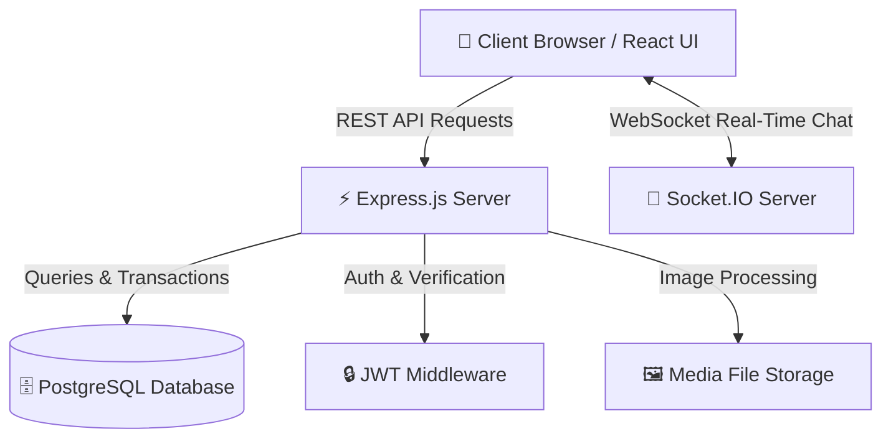

<div align="center">

  <h1>🌱 TBR3 (تبرّع)</h1>
  <p><b>A Green Computing Charity Platform for Sustainable Second-Hand Item Donation</b></p>

  [](https://nodejs.org/)
  [](https://expressjs.com/)
  [](https://www.postgresql.org/)
  [](https://reactjs.org/)
  [](https://tailwindcss.com/)
  [](https://socket.io/)
  [](LICENSE)

  <br />

  <a href="#-about-the-project">About</a> •
  <a href="#-key-features">Features</a> •
  <a href="#-tech-stack">Tech Stack</a> •
  <a href="#-system-architecture">Architecture</a> •
  <a href="#-getting-started">Getting Started</a> •
  <a href="#-api-reference">API Reference</a>

</div>

---

## 📖 About The Project

**TBR3** (derived from the Arabic word **تبرّع** - *to donate*) is an innovative **green computing charity platform** designed to bridge the gap between people with surplus second-hand items and those in need.

Instead of discarding or selling pre-loved items, **TBR3** enables a circular economy model where goods are reused, reducing waste, lowering carbon footprints, and fostering community solidarity based on Islamic charity (*Sadaqah*) and social sustainability.

### 🌟 Core Vision
- **♻️ Environmental Sustainability:** Prolong product lifecycles and decrease e-waste & solid waste creation.
- **🤝 Social Solidarity:** Seamlessly connect generous donors with verified recipients.
- **⚡ High Performance & Scalability:** Powered by lightweight Node.js micro-services and PostgreSQL relational storage.

---

## ✨ Key Features

| Feature | Description |
| :--- | :--- |
| **🎁 Item Donation Hub** | Post second-hand items easily with descriptions, categories, and high-quality image uploads. |
| **🤝 Request & Claim System** | Receivers can browse, search, filter, and submit claim requests for donated items. |
| **💬 Real-Time Chat (Socket.IO)** | Direct in-app messaging between donors and recipients to arrange delivery & pickup safely. |
| **🔔 Instant Notifications** | Real-time push alerts for claim requests, status updates, and new chat messages. |
| **🛡️ Comprehensive Admin Panel** | Moderate users, monitor donation posts, handle reports, and manage categories. |
| **🔒 Enterprise Security** | Secure JWT authentication, password hashing (bcrypt), and SQL injection prevention. |

---

## 🛠️ Tech Stack

### **Backend Framework & Services**
- **Runtime:** Node.js (JavaScript / ES6+)
- **Server:** Express.js framework
- **Database:** PostgreSQL (Relational Data Model)
- **Real-Time Communication:** Socket.IO
- **Authentication:** JSON Web Tokens (JWT) & bcrypt encryption
- **File Storage:** Multer / Cloud image handler

### **Frontend Framework**
- **Library:** React.js
- **Styling:** Tailwind CSS (Modern, responsive utility-first CSS design system)
- **Icons & UI Elements:** Lucide / React Icons

---

## 🏗️ System Architecture



---

## 🚀 Getting Started

Follow these steps to set up **TBR3** locally on your machine.

### 📋 Prerequisites
Make sure you have the following installed:
- [Node.js](https://nodejs.org/) (v18.x or higher)
- [npm](https://www.npmjs.com/) (v9.x or higher)
- [PostgreSQL](https://www.postgresql.org/download/) database engine running locally or on a server.

---

### 1️⃣ Clone the Repository
```bash
git clone https://github.com/YOUR_USERNAME/TBR3.git
cd TBR3
```

---

### 2️⃣ Backend Setup

1. **Navigate to the server directory:**
   ```bash
   cd server
   ```

2. **Install dependencies:**
   ```bash
   npm install
   ```

3. **Configure Environment Variables:**
   Create a `.env` file inside the `server/` directory:
   ```env
   PORT=5000
   PG_USER=postgres
   PG_PASSWORD=your_password
   PG_HOST=localhost
   PG_PORT=5432
   PG_DATABASE=tbr3_db
   JWT_SECRET=your_super_secret_jwt_key
   ```

4. **Initialize Database Schema:**
   Import the schema into your PostgreSQL database using `database.sql`:
   ```bash
   psql -U postgres -d tbr3_db -f database.sql
   ```

5. **Start the backend server:**
   ```bash
   npm run dev
   # or
   npm start
   ```

---

### 3️⃣ Frontend Setup

1. **Open a new terminal and navigate to the client directory:**
   ```bash
   cd client
   ```

2. **Install dependencies:**
   ```bash
   npm install
   ```

3. **Start the frontend application:**
   ```bash
   npm start
   ```
   The client app will launch at `http://localhost:3000`.

---

## 🔌 API Reference Overview

| Endpoint | Method | Description | Auth Required |
| :--- | :---: | :--- | :---: |
| `/api/auth/register` | `POST` | Register a new donor/receiver account | ❌ No |
| `/api/auth/login` | `POST` | Authenticate user & issue JWT token | ❌ No |
| `/api/posts` | `GET` | Retrieve all available donation items | ❌ No |
| `/api/posts` | `POST` | Create a new donation post (with image) | 🔒 Yes |
| `/api/posts/:id` | `GET` | Get detailed information for a specific item | ❌ No |
| `/api/claims` | `POST` | Claim or request a donated item | 🔒 Yes |
| `/api/admin/users` | `GET` | View and manage registered users | 🛡️ Admin |
| `/api/admin/posts` | `DELETE` | Moderation: Remove inappropriate posts | 🛡️ Admin |

---

##  🌱 Environmental & Social Impact

```
             ┌──────────────────────────────────────────────┐
             │            TBR3 CIRCULAR FLOW                │
             └──────────────────────┬───────────────────────┘
                                    │
           ┌────────────────────────┴────────────────────────┐
           ▼                                                 ▼
  [ 📦 Surplus Items ]                             [ 🤝 Direct Charity ]
  Prevent electronic &                             Extend item lifecycle
  household waste creation                          for families in need
           │                                                 │
           └────────────────────────┬────────────────────────┘
                                    ▼
                     [ 🌱 Reduced Carbon Footprint ]
```

---

## 🤝 Contributing

Contributions are what make the open source community such an amazing place to learn, inspire, and create. Any contributions you make are **greatly appreciated**.

1. Fork the Project
2. Create your Feature Branch (`git checkout -b feature/AmazingFeature`)
3. Commit your Changes (`git commit -m 'Add some AmazingFeature'`)
4. Push to the Branch (`git push origin feature/AmazingFeature`)
5. Open a Pull Request

---

## 📝 License

Distributed under the **MIT License**. See `LICENSE` for more information.

---

<div align="center">
  <sub>Built with ❤️ for sustainability and community charity. Inspired by <b>تبرّع</b>.</sub>
</div>
